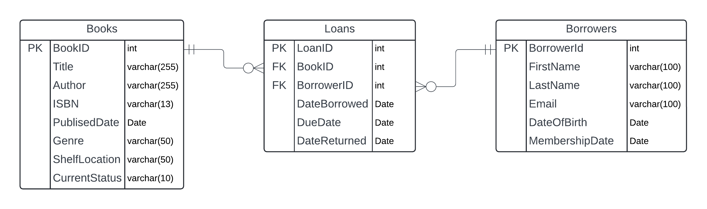

# LibraryManagementSystem

## Entity Relationshipo Model (ERM) Diagram

## Project Overview

The objective of this project is to design and implement a relational database using MS SQL that supports the library's operations and offers extensive querying capabilities.

## Requirements

- Design an ERM diagram
- Design the relational schema using MS SQL
- Build and seed the database
- Implement complex queries and procedures

## ERM Diagram

The following diagram represents the Entity Relationship Model (ERM) for the Library Management System (The diagram was done using Lucidchart):

## Database Schema AND Construction of DataBase in MS SQL:

The scripts for creating the tables are found in:

- [Create Books Table](schemas/create_tables/create_books.sql)
- [Create Borrowers Table](schemas/create_tables/create_borrowers.sql)
- [Create Loans Table](schemas/create_tables/create_loans.sql)

## Seed the DataBase in MS SQL:
The scripts for seeding the database are found in:
- [Seed Books Table](schemas/seed_tables/seed_books.sql)
- [Seed Borrowers Table](schemas/seed_tables/seed_borrowers.sql)
- [Seed Loans Table](schemas/seed_tables/seed_loans.sql)

Additionally, in order to correctly set currentSatus of books according to DateReturned field in Loans Table, this update script needs to be run:

[Update books table](schemas/seed_tables/update_books_currentstatus_if_not_returned.sql)

## Queries and Procedures

- **1. List of Borrowed Books:**  
-- [Script](queries/list_borrowed_books.sql)  
-- Rationale:  
--- At the beggining a variable was initialized (@BorrowerID), allowing quering different borrowers without modifying the query structure.  
--- A Join was used in order to access data from Books and Loans (where is the @BorrowerID)  

- **2. Active Borrowers with CTEs:**  
-- [Script](queries/active_borrowers_cte.sql)  
-- Rationale:  
--- A CTE was used (as requested) and then used in the las SELECT statement by its name.  
--- Inside the CTE a Join was used in order to get the information from the borrower and from the loan.  
--- Inside the CTE the WHERE clause is used to select only unreturned books.  
--- Inside the CTE a group by was used to show one line per borrower.  
--- Inside the CTE a HAVING was used to indicate that should be included only those appearing two or more times (borrower has at least two unreturned books).  

- **3. Borrowing Frequency using Window Functions:**  
-- [Script](queries/borrowing_frequency_window_functions.sql)  
-- Rationale:  
--- Window functions are used (as requested): RANK() and DENSE_RANK()  
--- The select is being made on Loans table and group by BorrowerID, showing only one row per borrower.  
--- For each borrower, a BorrowCount (COUNT(*)) column is added to show how many times a borrower has borrow a book.  
--- Then each borrower is ranked using same COUNT(*). Highest BorrowCount, Lower Rank.  
--- Dense_rank was used too in order to show the ranking without skipping numbers.  

- **4. Popular Genre Analysis using Joins and Window Functions:**  
-- [Script](queries/popular_genre_analysis.sql)  
-- Rationale:   
--- At the beggining, month and year variables were initialized, allowing quering different months without modifying the query structure.  
--- Window functions are used (as requested): RANK() and DENSE_RANK()  
--- Join is used between Loans and Books, to access popularity (BorrowCount from Loans) and Genre (from Books).  
--- Where clause is used to filter by the given month and year  
--- Group by is used to show only one row per Genre as it is the focus of the script (Most Popular Genre)  
--- For each genre, a BorrowCount (COUNT(*)) column is added to show how many times a genre has appeared in a borrow.  
--- Then each genre is ranked using same COUNT(*). Highest BorrowCount, Lower Rank.  
--- Dense_rank was used too in order to show the ranking without skipping numbers.  

- **5. Stored Procedure - Add New Borrowers:**  
-- [Script](procedures/add_new_borrowers.sql)  
-- Rationale:  
--- Before creating procedure, drop any procedure if exist with such name.  
--- A procedure was created with some parameters  
--- Using Select 1 to check if there is at least one row with email provided as parameter. Then if that row exist, raise error to avoid repeating borrower.  
--- If email does not exist, perform the insert into Borrowers Table with variables provided in parameters.  
--- Then the output variable is set with the BorrowerID of the newly created borrower.  
--- That @BorrowerID is used to SELECT FROM Borrowers and filtering the newly created borrower.  
--- At the end, the execution of the procedures is scripted, using variables as parameters.  

- **6. Database Function - Calculate Overdue Fees:**  
-- [Script](functions/calculate_overdue_fees.sql)  
-- Rationale:  
--- A function is used (as requested), with @loanID as parameter and a decimal as return type.  
--- Inside de function, three variables are declared to use in the if and return statements.  
--- After variable declaration, a value was assigned to each from a row in Loans table where the LoanID is the one coming as a parameter.  
--- Given that DateReturned may be null, it is set as current date with GETDATE();  
--- overdueDays are the days passed from the DueDate until the DateReturned or until current date if DateReturned is null  
--- Then all the logic for setting the overdueFee is made by if else statements, and overdueFee is returned.  
--- At the end, the function is used in a select statement, showing its return value as a column FROM Loans. Last three entries in Loans were purposely formed to check the functionality of this function.  

- **7. Database Function - Book Borrowing Frequency:**  
-- [Script](functions/book_borrowing_frequency.sql)  
-- Rationale:  
--- A function is used (as requested), with @bookID as parameter and an integer as return type.  
--- Inside de function, the returning variable is declared in order to use it to assign it a value  
--- The borrowingFrequency variable is assigned as the number of times a book was borrowed using a SELECT with the Loans Table, filtered by the bookID comming as parameter. Then borrowingFrequency is returned.  
--- At the end, the function is used in a select statement, showing its return value as a column FROM Books Ordered By this borrowing Frequency. So the most borrowed book will appear first.  

- **8. Overdue Analysis:**  
-- [Script](queries/overdue_analysis.sql)  
-- Rationale:  
--- A Join was made between Loans and Books and between loans and Borrowers to show the values in the select.  
--- The DATEDIFF funtion was used to filter those rows wich:  
    - Book was not returned and the Days passed from DueDate until current day were more than 30 OR  
    - Book was returned and the Days passed from DueDate until DateReturned were more than 30  

- **9. Author Popularity using Aggregation:**  
-- [Script](queries/author_popularity_using_aggregation.sql)  
-- Rationale:  
--- There is a Join between the Loans and Books tables.  
--- A group by Author is used, to show only one row per author  
--- The COUNT(*) is used, to show how many times a book with such author was borrowed  
--- Using that COUNT(*) a dense_rank was used to show the popularity of an author. The highest the borrowingFrequency the lowest the rank.  
--- All result were then ordered by the borrowingFrequency.  

- **10. Genre Preference by Age using Group By and Having:**  
-- [Script](queries/genre_preference_by_age.sql)  
-- Rationale:   
--- First a function is created in order to classify the age of a person (obtained from its birthdate) into an age group (returning a varchar with the ageRange name).  
--- After that, two CTEs are used: One for get the count by Age range and Genre, and the other to get the genre with more borrow count.  
--- Then, in the las select, the where clause is use to filter only the "preferred genre" for each age group.  

- **11. Stored Procedure - Borrowed Books Report:**  
-- [Script](procedures/borrowed_books_report.sql)  
-- Rationale:  
--- Before creating procedure, drop any procedure if exist with such name.  
--- A procedure was created with specified parameters  
--- The procedure returns a table with some data about the books and borrower.  
--- A Join is used to access columns from Loans, Books and Borrowers.  
--- A where and Between is used to filter between the startDate and endDate provided in parameters  
--- At the end, the execution of the procedure is scripted, declaring two variables and using them as parameters.  

- **12. Trigger Implementation:**  
-- [Script](triggers/book_statuschange_trigger_auditlog.sql)  
-- Rationale:  
--- Firstly, the AuditLog table is created with the instructed fields  
--- Then, the trigger is created for launching after an update on the Books table happens.  
--- Inside the trigger, first, some variables are declared and then asigned in a select statement using the INSERTED and DELETED tables which hold the new values and the old values in an update operation.  
--- Finally, only if status differ from before and after the update, an insert is performed in the AuditLog table.  
--- For testing the trigger, an update script in the books table is at the end, and then all AuditLog entries are shown.  

- **14. SQL Stored Procedure with Temp Table:**  
-- [Script](procedures/stored_procedure_temp_table.sql)  
-- Rationale:  
--- Before creating procedure, drop any procedure if exist with such name.  
--- A procedure was created with no parameters  
--- Inside the procedure, a temporary table is created (begin with '#')  
--- Then some data from loans and borrowers tables (using join) is inserted into temp table. The distinct word is used to insert a borrower only once. The where clause is used to filter when book has not been returned and has passed 1 day or more after the dueDate for returning the book.  
--- Then the temp table is used joined with Loans and Books to list the overdue books for each borrower, only if book has not been returned.  
--- Finally, in the procedure, the temp table is deleted (DROP TABLE)  
--- At the end, is the line for the execution of the procedure.  

- **BONUS: Weekly peak days:**  
-- For this exercise two approaches were used: one using only CTEs and other using a function and a CTE. The one using a function adds modularity and possibility of reuse.  
-- [Script](queries/weekly_peak_days.sql)  
-- Rationale:  
--- Three CTEs are created:  
--- LoanCounts, which from the Loans table, gets the name of the day of the week of the DateBorrowed and count how many loans where made on that day. Day of Week is also used in the group by to show only one line per day.  
--- TotalLoans, count all loans in the table  
--- DayPercentages, Takes the first CTE created, makes a Cross Join with the second CTE created for calculating the percentage of loans made on each week day comparing to the total loans in the table.  
--- Finally, a select is made on the last CTE created, showing the day of the week, how many loans where made on that day and what is its percentage compared to the total loans. The list is ordered by the percentage, showing the day with more loans first.  

-- [ScriptASFunction](functions/weekly_peak_days.sql)  
--- Eliminate function with such name if exists  
--- A function was created receiving number of loans and total loans and then returning the percentage it represents from the total count of loans table  
--- Then two CTEs are used: one to get all the names of the days in the week and the number of loans for each day; the other to get the total count of loans table  
--- Finally, the CTE and the function are used inside a select to show the days of the week, the loans en each day and the percentage it represents ordered by that percentage to know which are the three days with more loans.  

